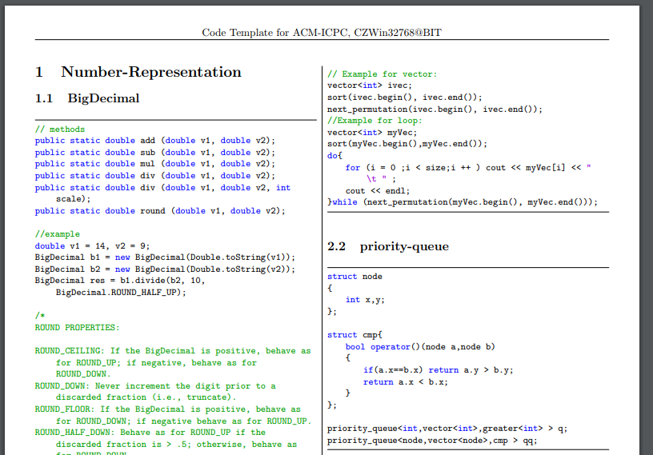

# A Simple ACM-ICPC Templates Generator
A really simple ACM-ICPC code templates generation tool. Only one command is all you need to generate your template from your source code directories without copy them to the docx or tex files.

What you only need to do is generate the template PDF file with `python gen.py`.

## Requirements

`python3` and `pdflatex` are required.

To install `pdflatex`, you can refer to [MikTex](https://miktex.org/).

## Author

@CZWin32768

## License

[MIT License](LICENSE)